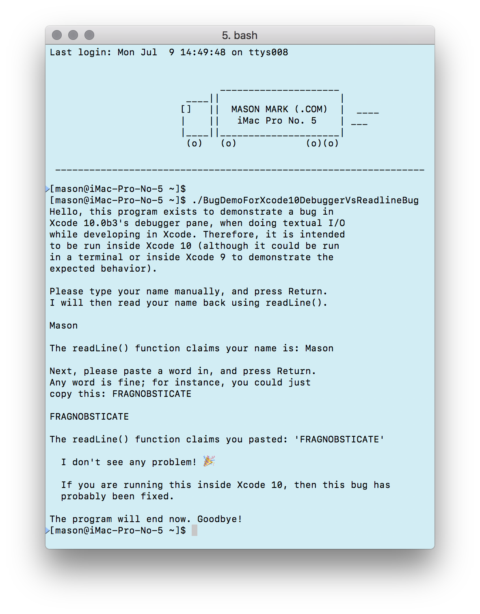
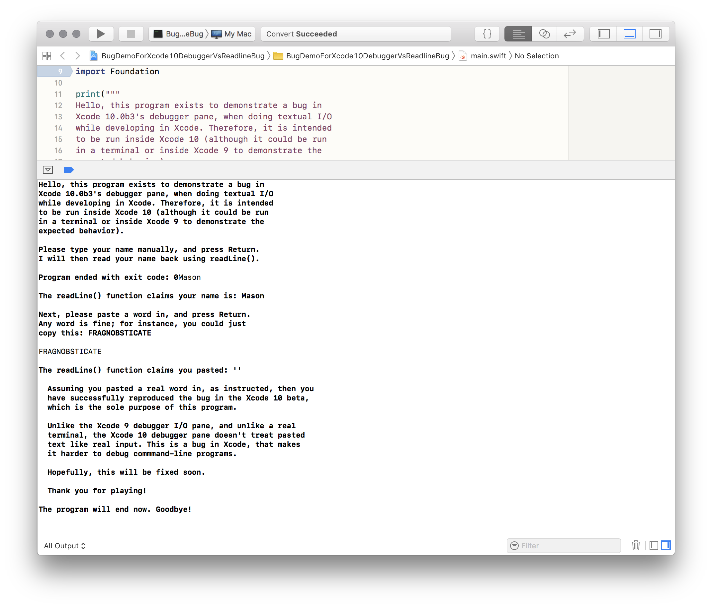

# BugDemoForXcode10DebuggerVsReadlineBug

This project demonstrates a bug in the beta of Xcode 10, where text input *pasted* into the console while debugging a command-line program is not recognized as input (text manually typed into the console works as expected).

Reproduced on 2018-07-09 with Xcode 10.0 beta 3 (10L201y).

## Reproduction steps

1. Run this program, which uses `readLine()` to read user-entered input.

## Expected behavior

It is expected that `readLine()` reads and returns the entered text, whether typed manually or pasted.

This is how it behaves in Xcode 9.4.1's debugger console, and in a real terminal:

## Actual behavior

Text pasted into the Xcode 10 debugger UI isn't seen by `readLine()` and it returns either the empty string `""` or, if some text was pasted and some typed manually, it returns only the portion typed manually.

Example screenshot:

## Impact

This issue makes it difficult to debug command-line programs in Xcode (especially those that require entering long strings, such as credentials and tokens).

以上
